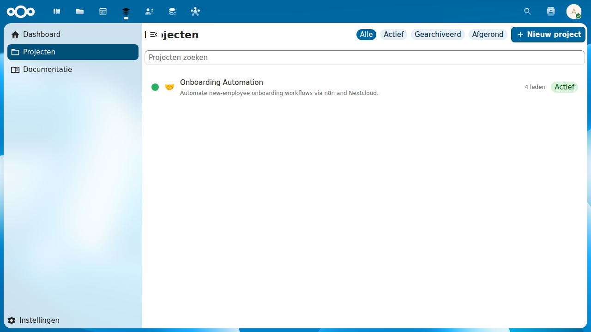
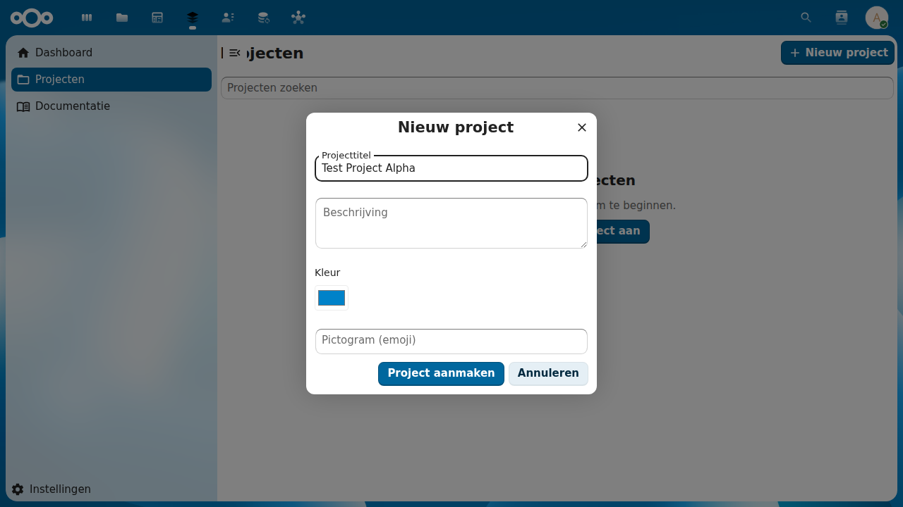
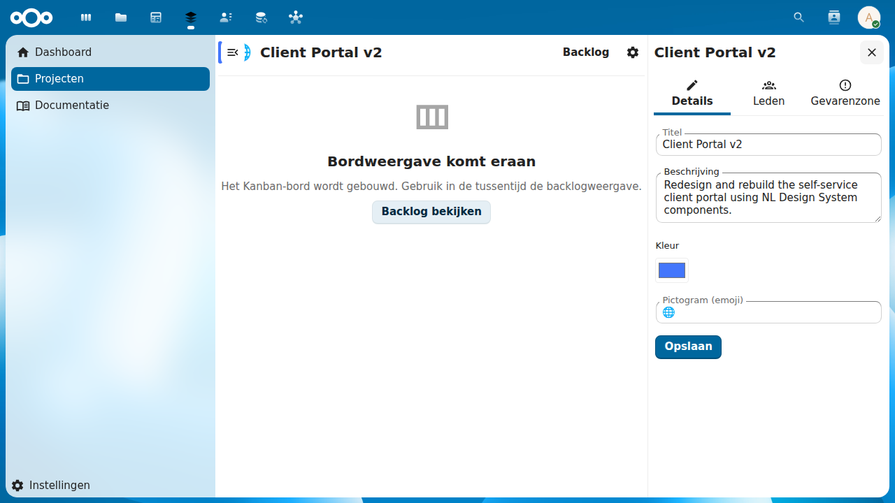

# Projects

Full project management surface for Planix — create, browse, configure, and delete projects.

## Overview

Projects are the top-level container in Planix. Each project groups a set of tasks on a kanban board, has a defined team (members), and optionally links to a Procest case. The `projects` change implements the complete project management UI on top of the OpenRegister data layer established by `register-schemas`.

## Screenshots

*Project list — browse and filter projects you are a member of*

*Create project — title, description, color, and icon fields*

*Project settings sidebar — Details, Members, and Danger Zone tabs*

## Key Capabilities

- **Project list** — browse all projects you are a member of; search (debounced 300 ms, client-side) and filter by status (Active / Archived / Completed)
- **Create project** — modal dialog with title, description, color, icon fields; automatically creates 4 default columns (To Do / In Progress / Review / Done) on creation
- **Project board shell** — detail view with header, gear icon, and "View Backlog" link; board view placeholder until kanban-board change is implemented
- **Project settings sidebar** — three-tab sidebar: Details (title, description, color, icon), Members (add/remove/leave), Danger Zone (archive, delete)
- **Member management** — search Nextcloud users, add to project, remove with assigned-task warning, leave with last-member protection
- **Access control** — project list filtered to current user's memberships; direct URL navigation to non-member projects shows access-denied state
- **Archive and delete** — archive hides from default list; delete cascades to columns, tasks, and time entries with confirmation dialog showing task count
- **i18n** — full Dutch (nl) translation; all strings in `l10n/en.json` and `l10n/nl.json`
- **Immediate metadata reflection** — sidebar saves update page header and project list without full reload

## Standards

- Schema.org CreativeWork (project as a creative work container)
- iCalendar VTODO parent container reference
